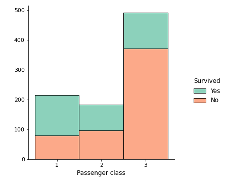

# Binary Classification

This project is based on Titanic dataset, and the task is to predict who survived and 
who didn't given their sex, age, fare, etc.

## Methods and tools
* Data Cleaning, Feature Engineering - Pandas
* Data Imputation - MICE algorithm from impyute library
* EDA, Visualization - matplotlib, seaborn, Pandas
* Modeling - keras, sklearn

## Result
The model got 83% accuracy on validation data and 78% on testing data, which puts me 
in top 22% of Kaggle Titanic competition.
